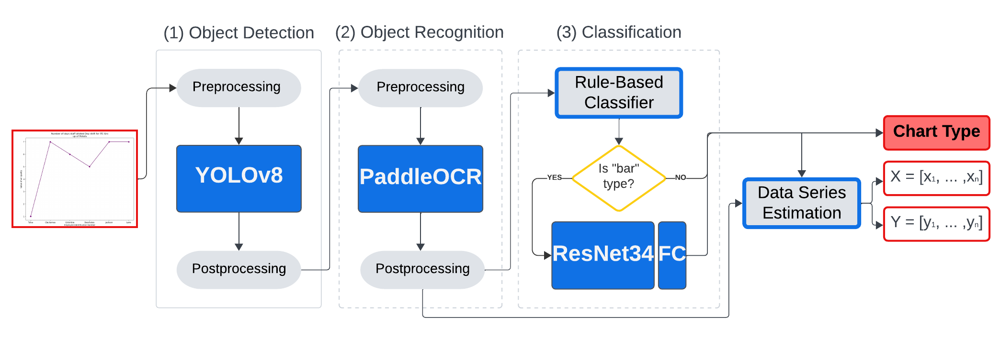

# MGA: Making Graph Accessible

making graph accessible (a Kaggle competition) 


link to data: [Google Drive Link](https://drive.google.com/drive/folders/1ZM9y2OkGAk_A_dK-ZhtE0oXLPzaYtjew?usp=sharing)

generated data: [gen data](https://www.kaggle.com/datasets/roihezkiyahu/mga-generated-charts)

A comprehensive solution for the making graph accessible Kaggle competition, primarily focusing on image-based chart detection, classification, and data estimation. This repository contains tools and models tailored for the Betech competition.

---

### Introduction

The "Making Graph Accessible" competition on Kaggle is aimed at promoting the accessibility of educational materials, especially for students with disabilities. Graphs and charts, common in STEM (Science, Technology, Engineering, and Math) subjects, remain a challenge for these students. This competition seeks solutions to automatically extract data from four types of charts, making the content more accessible.

**Overview**:
- **Goal**: Develop an automatic solution to extract data from common STEM charts.
- **Importance**: Many students face challenges accessing traditional educational content due to learning, physical, or visual disabilities. While text has become more accessible, graphs remain a challenge.
- **Impact**: The solutions from this competition will integrate into Benetech’s PageAI product, enhancing the accessibility of STEM materials for millions.

---

### Table of Contents

- [Installation](#installation)
- [Usage](#usage)
- [Modules Overview](#modules-overview)
- [Evaluation](#evaluation)
- [Dataset Description](#dataset-description)
- [License](#license)
- [Acknowledgments](#acknowledgments)

---

### Installation

```bash
# Clone the repository
git clone https://github.com/roihezkiyahu/mga

# Navigate to the repository
cd mga

# Install the required dependencies
pip install -r requirements.txt
```

---

### Usage

- **Data Generation**: Use the scripts in the `data_generation` module to simulate and generate charts and their annotations.
- **Model Training and Prediction**: Navigate to the `models` directory and use the provided scripts to use trained models, you can train the models using the examples in `notebooks`.
- **Visualization**: Use the `plot_functions` module for visualization tools and functions.
- **Utilities**: The `utils` directory contains essential utilities for data processing and model support.

---

### Modules Overview

- **data_generation**: Responsible for generating or preparing data, with functions related to creating charts and figures.
- **models**: Contains various models and related utilities, including classifiers, detectors, and data series predictor.
- **plot_functions**: Provides utilities for plotting and visualization, focusing on annotated images.
- **utils**: Essential utility functions for data processing, YOLO object detection handling, and support for the other modules.

---

### Evaluation

The objective is to predict data series from four types of scientific charts: bar graphs, dot plots, line graphs, and scatter plots. The evaluation is based on both the Levenshtein distance for categorical data and RMSE for numerical data. Successful predictions require matching the chart type and the number of values in the series, following which the data series is evaluated based on its type.

---

### Dataset Description

The dataset consists of approximately 65,000 annotated scientific figures of various types, including bar graphs, dot plots, line graphs, and scatter plots. While most figures are synthetic, several thousands are extracted from professional sources. The task is to predict the data series for the test set figures.

For more detailed information, participants are referred to the competition page on [Kaggle](https://www.kaggle.com/competitions/benetech-making-graphs-accessible).

---

### License

This project is licensed under the MIT License.

---

### Acknowledgments

Special thanks to Benetech for hosting the competition and to Schmidt Futures for their support.

